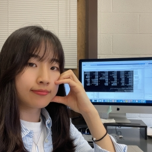
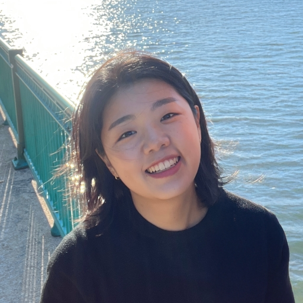
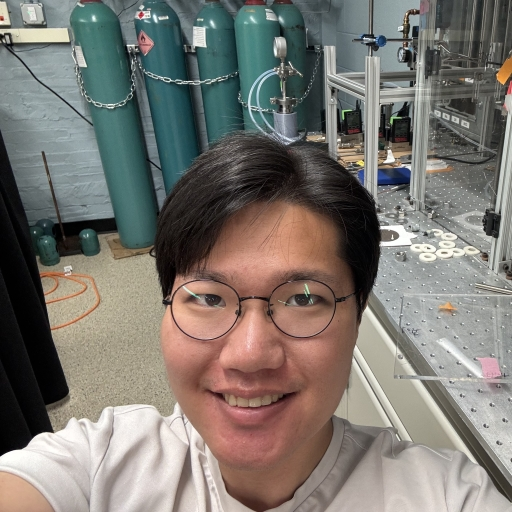
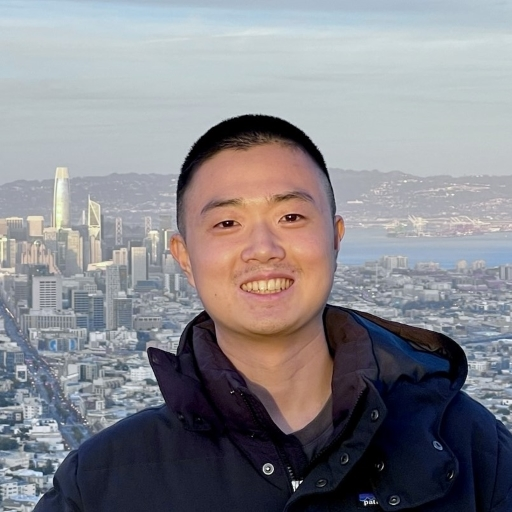
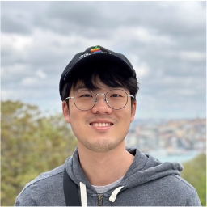
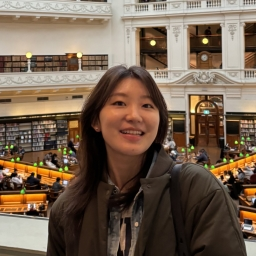
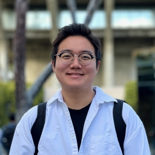

# Members
#### JeongA Lee (이정아)

>JeongA (Jenna) is a PhD candidate in Mechanical Science and Engineering at the University of Illinois Urbana-Champaign, advised by Prof. Kyle Smith. Her research focuses on carbon dioxide removal (CDR) and electrochemical system optimization. She develops physicochemical models of electrochemical pH-swing direct air capture (DAC) systems, integrating reaction kinetics, thermodynamics, and system-level parameters. Through computational modeling, she analyzes performance trade-offs and identifies strategies for energy-efficient DAC design. She has strong skills in MATLAB-based modeling, numerical simulation, and translating complex model outputs into actionable engineering insights.

#### Jiyoung Kim (김지영)

>Jiyoung is currently pursuing her Ph.D. at Cornell University, focusing her research on nanoscale thermal transport in polymers and semiconductors. Her expertise spans nanoscale thermal modeling, such as molecular dynamics (MD) simulations and the electron-phonon coupled Boltzmann transport equation (BTE), as well as thermal conductivity measurements using laser-based transient thermal grating (TTG).

#### Taewoo Kim (김태우)

>Taewoo is a PhD candidate in Mechanical Science and Engineering at the University of Illinois Urbana-Champaign. His research explores the fundamental mechanisms of diamond particle growth, focusing on how different hydrocarbon precursors and doping elements influence the growth process under flat flame combustion. By combining experimental work with reaction simulations, Taewoo aims to develop a deeper understanding of material synthesis pathways that can lead to enhanced control over diamond film properties.

#### Jihong Min (민지홍)

#### Luke Gyubin Min (민규빈)

>Luke is a PhD student in Mechanical Engineering at Stanford University, advised by Prof. Kenneth E. Goodson and Adjunct Prof. Mehdi Asheghi at the Nanoheat Lab. His research focuses on advanced thermal management solutions for next-generation electronic systems, covering nanoscale heat dissipation in ultra-thin films and 3D packaging as well as macroscale cooling strategies for end-user devices and data centers.

#### [YoungJoon Park (박영준)](./members/joon)

>YoungJoon (Joon, in short) is a PhD candidate in Mechanical Science and Engineering at the University of Illinois Urbana-Champaign. His research focuses on developing novel methodologies to monitor and control energy systems, particularly in application to air conditioning & refrigeration cycles and fuel cell systems. His current project focuses on the development of a capacitive sensor array for measuring water droplets and frost sizes under condensation and frosting heat transfer.

#### Dongyoung Yoon (윤동영)

>Dongyoung Yoon is a PhD candidate in Mechanical Science and Engineering at the University of Illinois Urbana-Champaign. His current research delves into the fascinating physics of two-dimensional heterostructures, specifically focusing on the novel phenomena emerging from strain-induced effects and the intriguing behavior of sliding ferroelectric materials.

#### Inseo Woo (우인서)

>Inseo is a PhD student in Materials Science and Engineering at the University of Illinois Urbana-Champaign. Her research focuses on the mechanical behavior of metallic materials in extreme environments and energy applications. She specializes in experimental characterization techniques for quantitative, statistical analysis of deformation processes, such as digital image correlation and electron microscopy. Using these techniques, she aims to investigate plasticity development driven by hydrogen embrittlement, ultimately to accelerate the design of hydrogen storage materials.

#### Jiyong Harrison Lee (이지용)

>Jiyong Lee is a PhD student in Chemical Engineering at the University of Texas at Austin. Under the guidance of Prof. Ilias Mitrai, Jiyong’s research focuses on developing a framework and algorithms of explainable optimization via artificial intelligence techniques such as explainable AI and graph neural networks. In this approach, he aims to understand and provide explainable solutions of the optimal decision-making process that arises in energy systems, supply chains, and chemical manufacturing.

#### Janghyun Lim (임장현)

