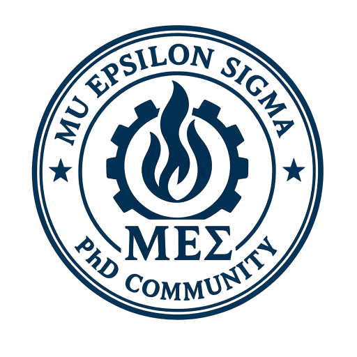

# About us

  

The ΜΕΣ community is a vibrant network of PhD students across the United States possessing broad expertise spanning mechanical, chemical, and materials engineering. These scholars share a common academic heritage, having graduated from the esteemed Multiphysics Energy Systems Laboratory (MESL) at Yonsei University in South Korea. United by a passion for pushing the boundaries of research, they carry forward a strong foundation in innovation developed during their time at MESL. Their work spans vital areas such as heat transfer, continuum mechanics, and energy systems—contributing meaningfully to global efforts in creating efficient and sustainable energy solutions. The ΜΕΣ community is defined by its commitment to academic excellence and its dynamic, ongoing exchange of ideas among members across the U.S.

# Members
*  [List of Members](./List-of-Members)

# News
* [JeongA has published her work on direct air capture in Environmental Science and Technology. Congratulations!🎉](https://news.illinois.edu/new-electrochemical-device-targets-climate-change-by-sucking-co2-out-of-air/?utm_source=newsbureau&utm_medium=email)
* [JeongA has won the Outstanding TA Award for the 2025–2026 academic year in the Department of Mechanical Engineering at UIUC! Congratulations!🎉](https://mechse.illinois.edu/news/83003)

# Events
## Upcoming events
*  [2026 Thanksgiving 4th Annual Meeting](./4th-Annual-Meeting)

## Previous events
*  [2025 Thanksgiving 3rd Annual Meeting](./3rd-Annual-Meeting)
*  [2024 Thanksgiving 2nd Annual Meeting](./2nd-Annual-Meeting)
*  [2023 Thanksgiving 1st Annual Meeting](./1st-Annual-Meeting)

# Contacts
e-mail: muepsig@gmail.com
